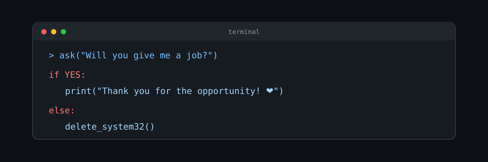

<h1 align="center">Juan Parhuayo</h1>

<p align="center">
  
</p>

---

## 🧑‍💻 Sobre mí

🎓 Graduado en **Desarrollo de Aplicaciones Multiplataforma (DAM)**.

Actualmente estoy reforzando mis conocimientos de **Java y Spring Boot**, creando proyectos personales y practicando especialmente desarrollo backend.

También sigo practicando **frontend**, bases de datos y otras tecnologías que he aprendido durante mi formación.

🎯 Mi objetivo es seguir aprendiendo, crear proyectos cada vez más completos y comenzar mi carrera profesional como desarrollador.

---

## 🛠️ Tecnologías

### 💻 Desarrollo

<p>
  
</p>

### 🌐 Frontend

<p>
  
</p>

### 🗄️ Bases de datos

<p>
  
</p>

### 🔧 Herramientas

<p>
  
</p>

---

## 🚀 Proyectos

### 📋 Gestor de tareas

Proyecto personal actualmente en desarrollo para practicar **Java, Spring Boot y bases de datos**, reforzando mis conocimientos de backend.

🔗 [Ver proyecto](AQUI_EL_LINK_DEL_REPOSITORIO)

### 💰 Gestor de gastos

Proyecto desarrollado durante mi formación utilizando **Kotlin**.

🔗 [Ver proyecto](https://github.com/AmerMiracle0230/GestorGastos)

### 🤖 Discord Bot

Proyecto realizado durante mi aprendizaje para practicar programación utilizando **JavaScript**.

🔗 [Ver proyecto](AQUI_EL_LINK_DEL_REPOSITORIO)

---

## 🌱 Actualmente aprendiendo

```text
Java
Spring Boot
PostgreSQL
HTML
CSS
JavaScript
```

Actualmente estoy centrado especialmente en **Java + Spring Boot**, mientras sigo reforzando frontend y bases de datos.

---

## 📫 Contacto

💼 [LinkedIn](https://www.linkedin.com/in/juan-parhuayo/)

---

⭐ Gracias por visitar mi perfil.
