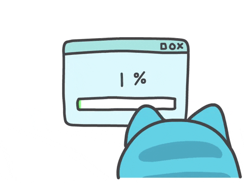

  

  
---
## 👨‍💻 Sobre mí

  
  
  <h3>🎓 Graduado en <strong>Desarrollo de Aplicaciones Multiplataforma (DAM)</strong></h3>
  
  

    Actualmente estoy reforzando mis conocimientos de <strong>Java y Spring Boot</strong>, creando proyectos personales y practicando especialmente desarrollo backend.
  

  
  

    También sigo practicando <strong>frontend</strong>, bases de datos y otras tecnologías que he aprendido durante mi formación.
  

  
  

    🎯 <strong>Mi objetivo:</strong> Seguir aprendiendo, crear proyectos cada vez más completos y comenzar mi carrera profesional como desarrollador.
  

---

## 🛠️ Stack Tecnológico

### Lenguajes y Frameworks

  <table>
    <tr>
      <td align="center" width="100">
        
         <strong>Java</strong>
      </td>
      <td align="center" width="100">
        
         <strong>Spring Boot</strong>
      </td>
      <td align="center" width="100">
        
         <strong>JavaScript</strong>
      </td>
      <td align="center" width="100">
        
         <strong>React</strong>
      </td>
    </tr>
  </table>

### Frontend

  <table>
    <tr>
      <td align="center" width="100">
        
         <strong>HTML5</strong>
      </td>
      <td align="center" width="100">
        
         <strong>CSS3</strong>
      </td>
      <td align="center" width="100">
        
         <strong>JavaScript</strong>
      </td>
    </tr>
  </table>

### Bases de Datos

  <table>
    <tr>
      <td align="center" width="100">
        
         <strong>MySQL</strong>
      </td>
      <td align="center" width="100">
        
         <strong>PostgreSQL</strong>
      </td>
    </tr>
  </table>

### Herramientas

  <table>
    <tr>
      <td align="center" width="100">
        
         <strong>Git</strong>
      </td>
      <td align="center" width="100">
        
         <strong>VS Code</strong>
      </td>
      <td align="center" width="100">
        
         <strong>IntelliJ IDEA</strong>
      </td>
    </tr>
  </table>

---
## 🚀 Proyectos Destacados

### 🚗 Concesionario Web
**Proyecto colaborativo desarrollado durante mi formación.** Aplicación web para catálogo y gestión de vehículos.

**Mi participación:** Desarrollo del backend con **Java y Spring Boot**, encargándome de la lógica de negocio, gestión de datos y API REST. El frontend fue desarrollado junto con mis compañeros.

  
  
  
  
  

🔗 [Ver repositorio](https://github.com/AmerMiracle0230/concesionario-web)

---

### 📋 Gestor de Tareas
Proyecto personal en desarrollo para practicar Java, Spring Boot y bases de datos.

  
  
  

🔗 [Ver repositorio](https://github.com/AmerMiracle0230/gestor-tareas)

---

### 💰 Gestor de Gastos
Proyecto desarrollado durante mi formación utilizando Kotlin.

  
  

🔗 [Ver repositorio](https://github.com/AmerMiracle0230/GestorGastos)

---

📂 **Ver todos mis proyectos:** [GitHub Repositories](https://github.com/AmerMiracle0230?tab=repositories)
---

## 🌱 Enfoque Actual

  <table>
    <tr>
      <td align="center" width="120">
        
         <strong>Java</strong>
      </td>
      <td align="center" width="120">
        
         <strong>Spring Boot</strong>
      </td>
      <td align="center" width="120">
        
         <strong>React</strong>
      </td>
      <td align="center" width="120">
        
         <strong>PostgreSQL</strong>
      </td>
    </tr>
  </table>

